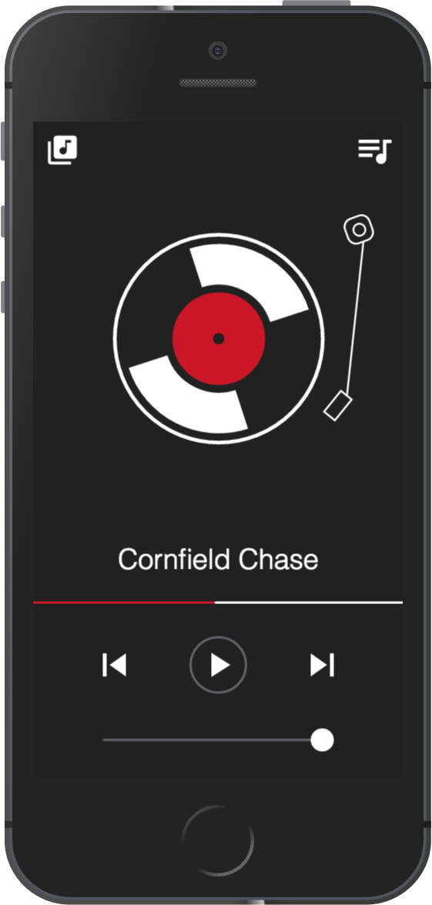

	

# iTunes Remote
Remotely control iTunes on Mac without Internet!  
Multiple clients can access the remote independently, and the UI will always be in sync    
 
✨ Built using WebSockets, AppleScript, React, and Redux ✨

## Usage:  
 - `git clone https://github.com/Siddharth11/iTunes-Remote.git`  
 - `cd iTunes-Remote`  
 - `npm install --only=production` or `yarn install --prod`  
 - `npm start`  
- Open the displayed link in a browser to access the remote. The other device should be on same network, a Wi-Fi hotspot without internet would also work.

## Features
- Play & Pause current track
- Play next & previous track
- Change volume
- Play a particular track or playlist
- Start iTunes if not running

## Prerequisites
- macOS or OSX
- Node >= 6.0

## Development
- Install all dependencies  
`npm install` or `yarn`  
- Start server   
`npm start`  
- Start JS (ES6) and Sass compilation  
`npm run dev`  
- Final build  
`npm run build`

## How is it different from the already existing Remote app by Apple?
Functionality wise both are similar. Although, the Apple app only works on Apple devices. Whereas, this is a web app, you can open it on any device with an internet browser. And it works without Internet too.  
Make a hotspot ➡ open the displayed link in a browser ➡ annnd you're good to go! 🚀
